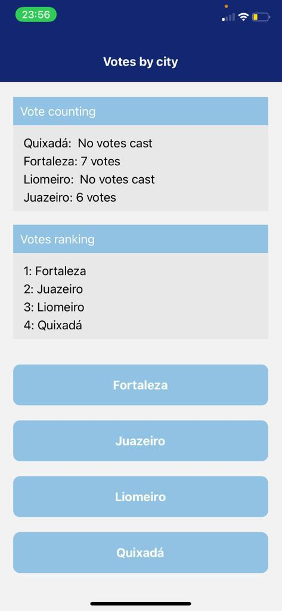

# Votes by city
Submodule of repository <a href="https://github.com/LuisFernando1407/pidm">PIDM</a>

- Pre-execution
  - <b>npm install</b>
  - Access the <b>expo</b> folder within <b>node_modules</b>
  - Open the <b>AppEntry.js</b> file
  - Delete the <b>import App...</b> and add the following code: <b>import App from '../../src/App'</b>

- App preview

